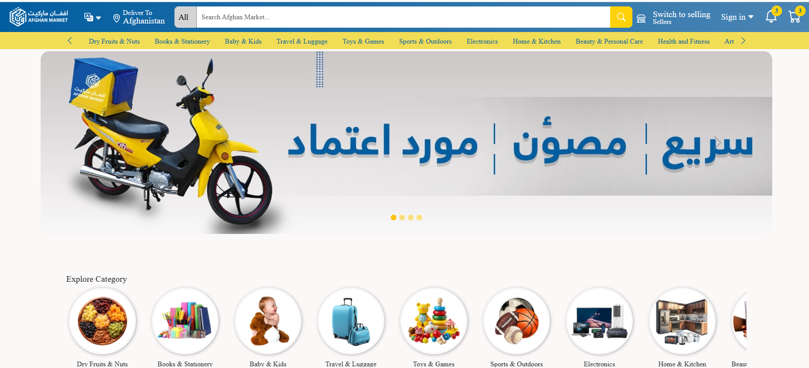

# Hi 👋 I'm Qayoum Khan

## Full Stack Developer
Spring Boot | Angular | Flutter | PostgreSQL

---

# 🛒 eCommerce Platform

A complete multi-platform eCommerce system built with modern technologies.

## 🚀 Project Modules

- 🧑‍💼 Vendor Mobile App
- 🛍 Customer Mobile App
- 🚚 Delivery Mobile App
- 🌐 eCommerce Website
- ⚙️ Admin Panel
- 🔐 Spring Boot Backend APIs

---

## 🛠 Technologies

### Frontend
- Angular
- Flutter

### Backend
- Spring Boot
- JWT Authentication
- PostgreSQL

---

# 📸 Project Preview

  
  
  

  

  

---

# 🎥 Demo Videos

- [Customer App Demo](YOUR_LINK)
- [Vendor App Demo](YOUR_LINK)
- [Delivery App Demo](YOUR_LINK)
- [Website Demo](YOUR_LINK)
- [Admin Panel Demo](YOUR_LINK)

---

# 🔥 Features

- Multi Vendor System
- Product Management
- Order Tracking
- Delivery Management
- JWT Security
- Multi-language Support
- Admin Dashboard
- Real-time Order Status

---

# 📂 Repositories

- [Backend API](YOUR_BACKEND_REPO)
- [Admin Panel](YOUR_ADMIN_REPO)
- [Website](YOUR_WEBSITE_REPO)
- [Flutter Apps](YOUR_FLUTTER_REPO)

---

# 📫 Contact

- LinkedIn: YOUR_LINKEDIN
- GitHub: https://github.com/qayoumkhan
